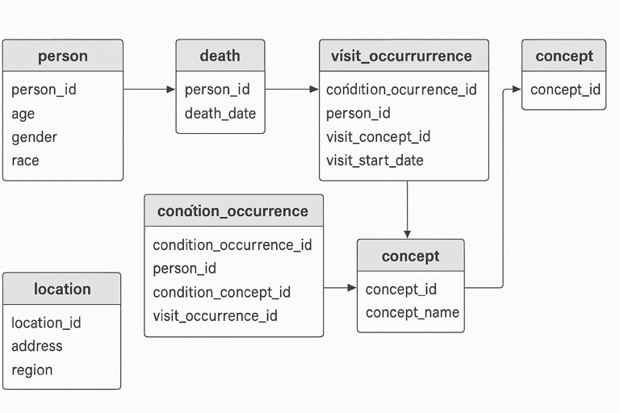

Here's the breakdown of how the CSV tables relate to each other in the notebook (and in general OMOP-style data):

---

### 🧍 `person.csv`
- **Key column:** `person_id`
- Central table that holds demographics (birth year, gender, race, etc.).
- Almost all clinical records (conditions, visits, death) link back to this via `person_id`.

---

### 💀 `death.csv`
- **Link to:** `person_id`
- Captures death date and cause. One row per person if applicable.
- Not everyone appears here—only deceased individuals.

---

### 🏥 `visit_occurrence.csv`
- **Link to:** `person_id`, `visit_concept_id`
- Records inpatient, outpatient, ER visits.
- You'll also see joins to `concept.csv` to decode the `visit_concept_id`.

---

### 🧠 `condition_occurrence.csv`
- **Link to:** `person_id`, `condition_concept_id`, `visit_occurrence_id`
- Lists diagnosed conditions per person.
- Often joins to `visit_occurrence` (to see when/where the condition was diagnosed).
- Joins to `concept.csv` to explain `condition_concept_id`.

---

### 📚 `concept.csv`
- **No `person_id`**
- Lookup table for all coded terms (conditions, visits, etc.)
- Used to decode concept IDs (like `visit_concept_id`, `condition_concept_id`) into human-readable names.

---

### 📍 `location.csv`
- **No `person_id` directly**
- Describes geographic data (address, county, etc.)

---

### TL;DR Relationships:

```
person.person_id ←——┐
                    ├—— visit_occurrence.person_id
                    ├—— condition_occurrence.person_id
                    └—— death.person_id

visit_occurrence.visit_occurrence_id ←—— condition_occurrence.visit_occurrence_id

condition_occurrence.condition_concept_id → concept.concept_id
visit_occurrence.visit_concept_id → concept.concept_id
```



<br>
